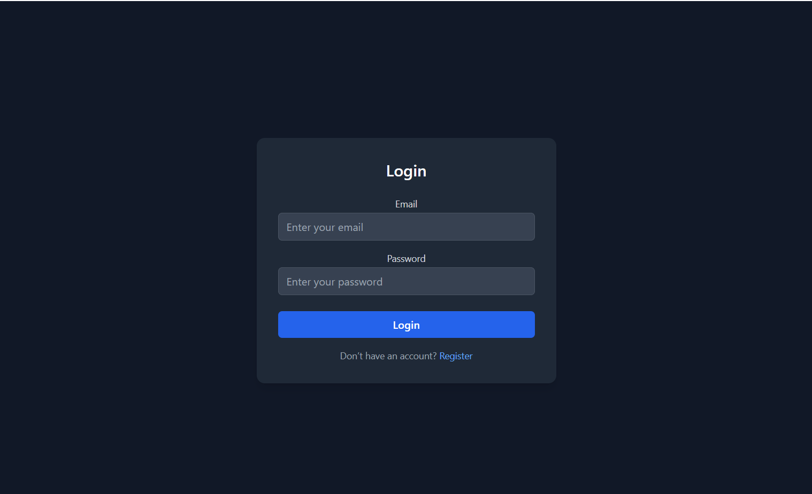
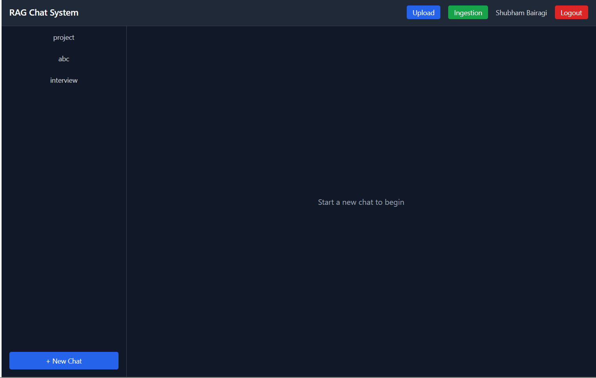

🤖 AI RAG Multichat Application

An AI-powered Retrieval-Augmented Generation (RAG) based Multichat Application that allows users to create chat sessions, ask questions, and receive intelligent, context-aware responses in real time using LLM and document retrieval.

❗ Problem Statement

In many organizations, critical knowledge is scattered across documents, internal systems, and databases. Traditional search systems:

❌ Return irrelevant keyword-based results
❌ Lack contextual understanding
❌ Do not support conversational interaction
❌ Slow down decision-making and productivity

👉 As a result, employees waste significant time searching for accurate information.

💡 Solution

This project solves the above problem by building a RAG-based conversational AI system that:

Retrieves relevant context from documents using vector search
Uses LLM to generate accurate, contextual answers
Provides a chat-based interface for natural interaction
Maintains chat history for continuity and traceability
📈 Business Impact
⏱️ Reduces information retrieval time by 70–80%
📊 Improves decision-making with context-aware insights
🤖 Enables scalable AI-powered knowledge assistants
🏢 Applicable to enterprise support, internal tools, and customer systems
🚀 Features
💬 Multi-chat session support
🤖 LLM-powered intelligent responses
📚 Retrieval-Augmented Generation (RAG) pipeline
🔐 Secure authentication and chat workflow
⚡ Real-time query processing
🗄️ SQL database integration for chat history
🎨 Interactive and responsive React UI
🎬 Chat Application Demo

This demo illustrates the end-to-end chat functionality of the application.
A user creates a chat session, submits a question, and the system processes the query using a RAG + LLM pipeline to generate and display an intelligent response in real time through an interactive chat interface.

  

🔐 Login Page

The login interface enables users to securely access the application before interacting with the AI-powered chat system.

  

🖥️ Main UI Dashboard

After successful login, users can create chat sessions, send queries, and view AI-generated responses dynamically within the chat interface.

  

🧠 System Architecture (RAG + LLM)

The application follows a Retrieval-Augmented Generation (RAG) architecture that integrates a React-based frontend, FastAPI backend, vector retrieval system, and Large Language Model (LLM) to deliver context-aware responses in real time.

  

🔄 Architecture Flow
User Interaction (Frontend - React.js)
User creates a chat session
Submits a query through the UI
API Layer (FastAPI Backend)
Receives user query via REST API
Handles chat session management
Stores chat history in SQL database
RAG Pipeline Execution
Query is converted into embeddings
Relevant documents are retrieved from the vector store
Context is passed to the LLM
LLM Response Generation
LLM processes the query + retrieved context
Generates a contextual and accurate response
Response Delivery
Backend sends the generated response to frontend
UI updates the chat interface in real time
🧩 Core Components
Frontend: React.js (Chat UI & User Interaction)
Backend: FastAPI (API & Business Logic)
Database: SQL (Chat sessions & history storage)
Vector Store: Stores embeddings for semantic retrieval
LLM Engine: Generates intelligent responses using retrieved context
RAG Framework: Enhances accuracy with contextual document retrieval
🏗️ Project Structure
RAG-Multichat-App/
├── frontend/          
├── backend/           
├── assets/            
│   ├── demo.gif
│   ├── login.png
│   ├── ui.png
│   └── architecture.png
├── README.md
└── requirements.txt
🛠️ Tech Stack
🎨 Frontend
React.js
Tailwind CSS
JavaScript (ES6+)
⚙️ Backend
Python
FastAPI
SQL Database
🧠 AI / RAG Stack
Retrieval-Augmented Generation (RAG)
Large Language Model (LLM)
Vector Embeddings
Semantic Search & Context Retrieval
⚙️ Backend Setup (FastAPI)
cd backend
pip install -r requirements.txt
uvicorn main:app --reload

Backend will run on:

http://127.0.0.1:8000
💻 Frontend Setup (React)
cd frontend
npm install
npm start

Frontend will run on:

http://localhost:5173
🔄 Application Workflow
User logs into the application
Creates a new chat session
Submits a query/question
Backend processes the query using the RAG pipeline
Relevant context is retrieved from the vector store
LLM generates a contextual response
Response is returned and displayed in the chat UI in real time
📌 Use Cases
AI Knowledge Assistant
Enterprise Chatbot Systems
Document Q&A Applications
RAG-based Conversational AI Systems
👨‍💻 Author

Shubham Bairagi
AI/ML Engineer
https://github.com/Shubham1866
